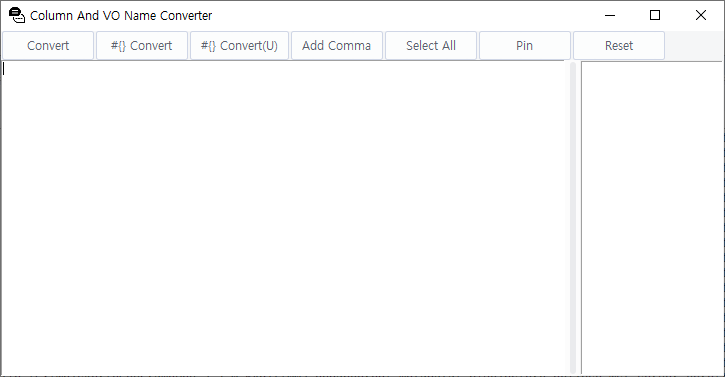
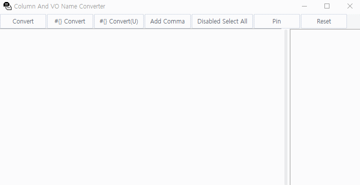

# 컬럼명/VO명(DAO) 변환기
- [ENGLISH](README.md)
- [KOREAN](README-kr.md)

이 어플리케이션은 몇 번의 클릭과 복사-붙여넣기 작업만으로 컬럼명과 VO명(DAO)을 쉽게 변환할 수 있게 도와줍니다!  
데이터베이스 개발자와 관리자들이 자주 다른 명명 규칙 간에 전환해야 하는 경우에 유용한 도구입니다.


## 사전 요구사항 & 설치 방법
Python 3.x가 기기에 설치되어 있어야 하며, Python 표준 라이브러리인 Tkinter 라이브러리도 필요합니다.

응용 프로그램을 실행 파일 (.exe)로 컴파일하려면 PyInstaller도 필요합니다:
```shell
pip install pyinstaller
```

그런 다음, 아래 명령어를 실행하여 .exe 파일을 생성합니다:
```shell
pyinstaller --onefile --noconsole column-vo-name-converter.py
```


## 사용 방법




1. **컬럼명/VO명 입력**  
   응용 프로그램 왼쪽의 텍스트 필드에 컬럼 이름 또는 VO 이름을 입력하세요.
3. **변환**  
   'Convert'를 클릭하여 컬럼 이름과 VO 이름 사이를 변환하세요. 변환된 결과는 응용 프로그램 오른쪽의 리스트 박스에 나타납니다.
5. **쉼표 추가**  
   각 줄의 시작 부분(첫 번째 줄 제외)에 쉼표를 추가해야 하는 경우 'Add Comma'를 클릭하세요. 이 작업은 입력 텍스트와 변환 결과 모두를 업데이트합니다.
7. **전체 선택**  
   'Select All' 버튼을 사용하여 입력 및 결과 리스트 박스 내 모든 텍스트를 쉽게 복사할 수 있도록 선택하세요.
9. **입/출력 초기화**  
    모든 입/출력을 지우려면 'Reset' 버튼을 클릭하세요.
11. **항상 위에 띄우기(고정하기)**  
    이 응용 프로그램을 다른 창 위에 항상 띄워두려면 'Pin' 버튼을 사용하세요.


## 문제 해결
이 응용 프로그램을 사용하면서 문제가 발생한 경우, 일반적인 문제와 그 해결책은 다음과 같습니다:

- **문제:** 응용 프로그램이 시작되지 않습니다.
  - **해결책:** Python과 모든 필요한 라이브러리가 기기에 올바르게 설치되어 있는지 확인하세요.
- **문제:** 변환이 예상대로 작동하지 않습니다.
  - **해결책:** 입력 텍스트가 올바른 형식인지 확인하세요.

여기에 나열되지 않은 문제가 발생하면 GitHub에서 문제를 제기하고, 문제와 오류 메시지를 설명하세요.


## 기여
이 프로젝트에 대한 기여는 환영입니다! 다음 방법으로 기여할 수 있습니다:

- GitHub 이슈를 통해 버그 보고나 기능 요청을 제출합니다.
- 이 저장소를 포크하고 변경 사항을 포함하여 풀 리퀘스트를 생성합니다.

풀 리퀘스트를 제출하기 전에 코드가 기존 스타일을 따르며 모든 테스트가 통과하는지 확인하세요.


## 라이센스
이 프로젝트는 MIT 라이센스에 따라 라이선스됩니다 - 자세한 내용은 [LICENSE](LICENSE) 파일을 참조하세요.


## 연락
이 프로젝트에 대한 질문이나 피드백은 아래 연락처로 부담 없이 연락주세요:

Email: k_gyujin@daum.net  
GitHub: [@kgyujin](https://github.com/kgyujin)