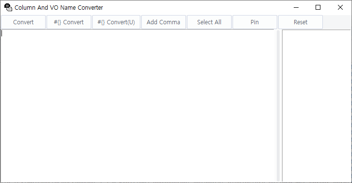
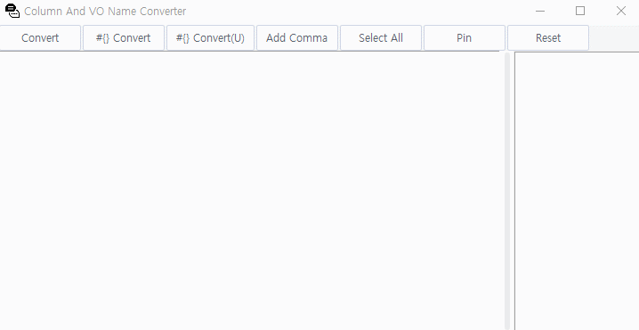

# Column Name/VO Name(DAO) Converter
- [ENGLISH](README.md)
- [KOREAN](README-kr.md)

This application allows you to easily convert between column names and VO names (DAO) with just a few clicks and copy-paste operations!  
It's a handy tool for database developers and administrators who frequently need to switch between different naming conventions.


## Prerequisites & Installation
You'll need Python 3.x installed on your machine along with the Tkinter library, which is included in the standard library of Python.

To compile this application into an executable file (.exe), you'll also need PyInstaller:
```shell
pip install pyinstaller
```

Then, run the following command to create the .exe file:
```shell
pyinstaller --onefile --noconsole column-vo-name-converter.py
```


## Application Usage




1. **Enter Column Name/VO Name**  
   Start by entering the column names or VO names into the text field on the left side of the application.
3. **Convert Names**  
   Click on 'Convert' to convert between column names and VO names. The converted results will appear in the list box on the right side of the application.
5. **Add Commas**  
   If you need to add commas at the beginning of each line (except for the first line), click 'Add Comma'. This will update both your input text and converted results.
7. **Select All Text**  
   Use 'Select All' button to select all text in your input and results list box for easy copying.
9. **Reset All Input and Results**  
    If you want to clear all input and results, simply click on 'Reset'.
11. **Always On Top**  
    You can use 'Pin' button to make this application stay always on top of other windows.


## Troubleshooting
If you encounter issues while using this application, here are some common problems and their solutions:

- **Problem:** The application doesn't start.
  - **Solution:** Ensure that Python and all necessary libraries are correctly installed on your machine.
- **Problem:** The conversion doesn't work as expected.
  - **Solution:** Make sure that the input text is in the correct format.

If you encounter a problem not listed here, please open an issue on GitHub with a description of the problem and any error messages.


## Contributing
Contributions to this project are welcome! Here's how you can contribute:

- Submit bug reports or feature requests through GitHub issues.
- Fork this repository and create pull requests with your changes.

Before submitting a pull request, please ensure that your code follows the existing style and all tests pass.


## License
This project is licensed under the MIT License - see the [LICENSE](LICENSE) file for details.


## Contact Information
For any questions or feedback about this project, feel free to contact me at:

Email: k_gyujin@daum.net  
GitHub: [@kgyujin](https://github.com/kgyujin)